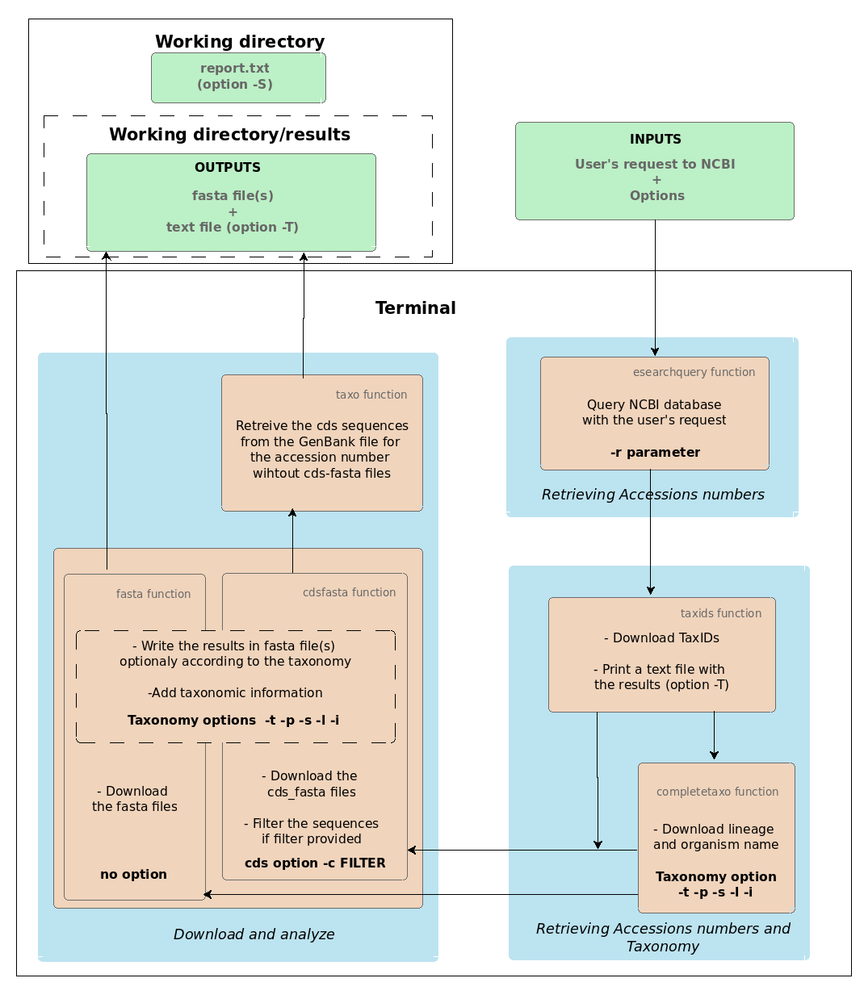

# nsdpy

[](https://opensource.org/licenses/MIT)
[](https://pypi.org/project/nsdpy/)


- [Introduction](#introduction)
- [workfolw](#workflow)
- [Installation](#installation)
- [Usage](#usage)
  - [Google Colab](#on-google-colab)
  - [Command line](#command-line)
- [Authors and acknowledgment](#authors-and-acknowledgment)
- [Support](#support)
- [Licence](#license)
- [More Documentation](#more-documentation)

## Introduction

NucleoPy aims to ease the download and sort of big bacth of DNA sequences from the NCBI database. 
It can also be usefull to filter the sequences based on their annotations.
Using NucleoPy the user can:

- **Search** NCBI nucleotide database
- **Download** the fasta files or the cds_fasta files corresponding to the result of the search
- **Sort** the sequences based on their taxonomy
- **Filter** the sequences based on the name of the gene by giving one or more regular expression as filter(s)

## Quick start


- Github: Clone the repo: git clone https://github.com/RaphaelHebert/nsdpy.git
- pip: Install with pip: 
```bash 
pip install nsdpy
```
- Google Colab: save a copy of [this notebook](https://colab.research.google.com/drive/1UmxzRc_k5sNeQ2RPGe29nWR_1_0FRPkq?usp=sharing) in your drive.

## Workflow



## Usage
### Google colab:

[Nucleopy colab notebook](https://colab.research.google.com/drive/1UmxzRc_k5sNeQ2RPGe29nWR_1_0FRPkq?usp=sharing)

### Command line

```bash
      nsdpy -r USER'S REQUEST [OPTIONS] 
```

## Authors and acknowledgment

## Support

## License

Code and documentation copyright 2021 the nsdpy Authors. Code released under the MIT License.

## More Documentation

For examples of usage and more detailed documentation check: 
[Users manual on google doc](https://docs.google.com/document/d/1CJQg2Cv3P0lgWZRYd9xJQfj8qwIY4a-wtXa4VERdH2c/edit?usp=sharing =100)


