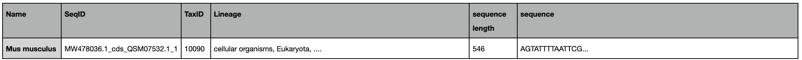

# NSDPY:‌ ‌Batch‌‌ ‌downloading‌ ‌from‌ ‌NCBI‌ ‌database‌ with‌ ‌python3‌

# Overview

**nsdpy** (NCBI sequence Downloader) aims to facilitate the download of large numbers of DNA sequences from the NCBI nucleotide database, sort them by taxonomic rank and if necessary, extract a specific gene from long sequences (e.g. mitochondrial genome) based on sequence annotations. Batch download for list of taxa is also possible. The main output is one or several fasta files (.fasta) and optionally Tab-separated value files (.tsv) with taxonomic information included in the description lines (see [examples](###Moreexamples)).

 

# Major steps

1. Based on a user’s query the program queries the Entrez API from NCBI using the e-utilities tools (Entrez Programming Utilities, see [this page](https://www.ncbi.nlm.nih.gov/home/develop/api/) for more information) to download the results available in the nucleotide database in fasta or fasta format containing only the coding DNA sequences (CDS) (see: [Fasta files for the CDS](###FastafilesfortheCDS)). The user has the possibility to add one or more text files containing a list of taxa to be added to the query.
2. Optionally the program analyzes the results to extract the desired gene based on sequence annotation
3. The sequences are sorted to files according to the taxonomic precision required. To accomplish this sorting the program first downloads the taxonomic information for each sequence from the NCBI Taxonomy database. The user can choose to add the taxonomic information to the information lines of the sequences.
4. The output files are in fasta format (and optionally tsv) and contain the information as found in the raw file and optionally, the following information can be added:
   - organism name
   - protein ID (in the case of CDS)
   - TaxID
   - lineage
   - sequence length (for the tsv format)

# Workflow

 

# File Formats

For more information on the different file formats:

- fasta file ( .fasta ): [Wikipedia: fasta format](https://en.wikipedia.org/wiki/FASTA_format)
- fasta for the cds ( .fasta ): a fasta file containing only the [CDS](<https://www.ncbi.nlm.nih.gov/pmc/articles/PMC403693/#:~:text=CDS%20is%20a%20sequence%20of,open%20reading%20frame%20(ORF).>). See: [Select fasta cds from the GUI ](###FastafilesfortheCDS)
- GenBank ( .gb ): [NCBI GenBank file](https://www.ncbi.nlm.nih.gov/GenBank/samplerecord/)
- Tab-separated value file ( .tsv ): [Wikipedia: Tab-separated value](https://en.wikipedia.org/wiki/Tab-separated_values)
- Text file ( .txt ): [File info](https://fileinfo.com/extension/txt#:~:text=A%20TXT%20file%20is%20a,editing%20or%20word%2Dprocessing%20program.&text=TXT%20files%20are%20simple%20text,and%20other%20text%2Dbased%20information.)

 

# Motivations for the programming choices

- Keep the use simple to allow users with a minimum of programming knowledge to be comfortable using the script.
- Minimize the dependencies to minimize installation steps and maintenance issues.
- Keep the script simple, available and open source to allow the users to modify it if needed.
- Find a simple way to download the results from a request to NCBI database keeping track of the possible missing sequences.
- Retrieve additional taxonomic information and automatically sort the results to save the user time-consuming manipulations.

To comply with these objectives two ways to use the program are available:

- from the terminal: this allows the users to include the script in a pipeline and to run the script directly from their own computer. (see [Instructions for use from the terminal](#instructions-for-use-from-the-terminal))
- from a google colab notebook (see: [what is google colab?](https://research.google.com/colaboratory/faq.html#:~:text=Colaboratory%2C%20or%20%E2%80%9CColab%E2%80%9D%20for,learning%2C%20data%20analysis%20and%20education.)): this allows the user to run the program online (from any web browser) and download the results automatically in their google drive without having to install anything on their own machine (see: [Instruction for use from Google colab notebook](#instruction-for-use-from-google-colab)).

 

# Instructions for use from the terminal

## Requirements and installation

**nsdpy** is a command line application written in Python3 that can be run from a terminal in most operating systems (Linux, Windows, Mac).
It is available on [PyPI website](https://pypi.org/project/nsdpy/) and can be installed from the terminal.

### Requirements

- Python 3.8+: [Python Downloads](https://www.python.org/downloads/)
- pip3: [pip installation](https://pip.pypa.io/en/stable/installation/)

### Install

#### As a package (simplest)

_Note that for the following commands, depending on user environment **pip3** may be replaced by **pip**_

    pip3 install nsdpy

To install the dependencies directly via pip3 (python3 package manager), download the requirements.txt file (available [here](https://github.com/RaphaelHebert/nsdpy/blob/main/requirements.txt)) in your working directory then use the following command:

    pip3 install -r requirements.txt

#### Download from GitHub

Alternatively, the script can be downloaded from [GitHub NSDPY repository](https://github.com/RaphaelHebert/nsdpy). The user only needs to download the nsdpy.py and functions.py files and have python 3.8+ (see: [Python Downloads](https://www.python.org/downloads/) ) and the request library (see: [requests documentation](https://requests.readthedocs.io/en/master/) and [request installation](https://pypi.org/project/requests/)) installed (users may have to use the command pip3 instead of pip for python3 depending on their installation). This minimum installation should be enough to run the script. Otherwise, the requirements are listed in the **requirements.txt** file (see above).

To run <b>nsdpy.py</b> the user needs to have the files <b>functions.py</b> and <b>nsdpy.py</b> files in the same directory, then run it from this directory.

## Minimum use

**Once nsdpy is installed as a package the following commands can be run from the terminal.**
Open a terminal and enter a **nsdpy** command with a compulsory **-r** argument

    nsdpy -r "This is a query to NCBI"

<ins>Example 1</ins>

The following command will download the fasta files for all results available in GenBank (see: [What is GenBank? ](https://www.ncbi.nlm.nih.gov/GenBank/)) with COX1 in the title:

    nsdpy -r "COX1[Title]"

or..

    nsdpy --request "COX1[Title]"

_These two requests are equivalent._

Let’s break this down:

- **nsdpy** is the name program called by the terminal.
- **-r** or **--request** just two different ways to call the same option, the first one being the shorthand notation of the second one.
- **"COX1[Title]"** is the user’s query to NCBI in double quotes. It is the same format as the one you would use to query the nucleotide database on [NCBI website](https://www.ncbi.nlm.nih.gov/).

<ins>Example 2</ins>

    nsdpy -r "mitochondrion[Title] AND complete[Title] AND Bryozoa[Organism]"

This command will download the fasta files for all complete mitochondrial genomes of Bryozoa available in the [nucleotide database](https://www.ncbi.nlm.nih.gov/nucleotide/).

<ins>Example 3</ins>

Download all sequences of four genera where COI is present in the title line:

    nsdpy -r "(Parnassius[ORGN] OR Pieris[ORGN] OR Melithaea[ORGN] OR Iphiclides[ORGN]) AND COI[Title]"

This command is identical to the following:

    nsdpy -r "COI[Title]" -L taxa.txt.

Where taxa.txt is a text file with each genus name in a separate line:

Parnassius
Pieris
Melithaea
Iphiclides

<b> GOOD TO KNOW . .</b>

- Help can be displayed by using the **-h** or **--help** option:

        nsdpy -h

  or..

        nsdpy --help

- Information on how to build a query to the NCBI search engine read the [NCBI Help Manual](https://www.ncbi.nlm.nih.gov/books/NBK44864/).
- Note that if the query has some white spaces or any other special characters it must be wrapped in quotes. On Windows terminal users must use the double quotes only.

 
 

## Options

The options can be displayed by using the help as described above.

### Version

**-V** (or **--version**) displays the nsdpy version and exits.

### API Key

**-a** (or **--apikey**) provides an API key when calling the Entrez API. Users can get an API key by registering to the NCBI website ( [Register here](http://www.ncbi.nlm.nih.gov/account/) ).
If no API key is provided the program works as well (it might be a little slower). To learn more about the API key see: [New API Keys for the E-utilities](https://ncbiinsights.ncbi.nlm.nih.gov/2017/11/02/new-api-keys-for-the-e-utilities/) .

### Verbose

    -v

or..

    --verbose

Displays more text output in the terminal, such as progression of downloads and analysis.

    -q

or..

    --quiet

No text output is displayed in the terminal.

Note that the **--verbose** and **--quiet** options are mutually exclusive.

### Gene selection

_note that single quotes can be avoided if the pattern does not include any special characters such as ., +, \*, ?, ^, $, (, ), [, ], {, }, |, or \\. ._

    -c 'PATTERN 1' 'PATTERN 2' ...

or..

    --cds 'PATTERN 1' 'PATTERN 2' ...

The program will download the cds_fasta files instead of the fasta files. The cds_fasta file is a FASTA format of the nucleotide sequences corresponding to all CDS features.
PATTERNS are optional. PATTERNS: [regular expression](https://www.debuggex.com/cheatsheet/regex/python) for filtering genes from the cds_fasta files and GenBank files corresponding to the [accession version identifiers](https://www.ncbi.nlm.nih.gov/GenBank/sequenceids/) resulting from the user’s query. The search is case insensitive.
This option is particularly interesting when looking for a gene from organites whole genomes or from DNA sequences containing more than one gene.

Example for the COX1 (or COI) gene:

    nsdpy -r "mitochondrion[Title] AND complete[Title]" -c 'COX[1I]' 'CO[I1]'

or..

    nsdpy --request "mitochondrion[Title] AND complete[Title]" --cds 'cox[1i]' 'CO[I1]'

_The above commands are identical._

Note that this option must be used separately from the others. For example to use the **--cds** option and the **--verbose** options these commands will run normally:

    nsdpy -r "This is a query to NCBI" -c -v

    nsdpy -r "This is a query to NCBI" -c 'pattern1' 'pattern2' -v

However, the following command will interpret the “v” as a pattern and not as the verbose option.

    python3 nsdpy.py -r "This is a query to NCBI" -cv

## output files

### TaxIds

    -T

or..

    --taxids

The program will write a text file with the accession version identifiers found and their corresponding TaxIDs separated by a tabulation.
Example:

    nsdpy -r "ITS2" -T

### Tab-separated values (--tsv or -t)

    -t

or..

    --tsv

The program will create two folders: "fasta" and "tsv". The fasta folder will contain the results in fasta format and the tsv folder will contain the results in tsv format.
Example:

    nsdpy -r "Homo sapiens[Organism] AND COX1[Title]" -tsv

### Information

Add the taxonomic information to the information lines of the sequences written in the output files.

    -i

or..

    --information

For the fasta files: add the Taxon name, protein ID (for the cds option only), TaxIDs and lineage to the information lines.
**In the output fasta files the taxon name is written without any spaces, eventual spaces are replaced by '\_'.** This is to help parsing these files automatically.
For the tsv files the header line will appears to be: name (organism name), SeqID (accession version number and protein ID), TaxID, Lineage, sequence length, sequence.

### Taxonomy

#### custom

    -x

or..

    --custom

The script will sort the sequences according to the taxonomic rank provided. (For example -x phylum, will produce one file per phylum). This option will use the taxonomy found in the .xml files returned by the call to Efetch for the taxonomy database, and thus does not need hardcoded list of taxa as is the case for earlier taxonomic options **--phylum** and **--kingdom**. See the documentation below for more information on these options.

Example:

    nsdpy -r "ITS2" -x kingdom

#### kingdom (--kingdom or -k)

    -k

or

    --kingdom

The program will write the results in different fasta files (one for the Metazoa, one for the Fungi, one for the Plantae and one for Others containing the sequence that doesn’t correspond to the above three kingdom)
Example:

    nsdpy -r "This is a query to NCBI" -k

#### phylum (--phylum or -p)

    -p

or..

    --phylum

The program will write the results in different fasta files, one file per phylum.
Example:

    nsdpy -r "This is a query to NCBI" -p

For the **-k** and **-p** options the phylums and kingdoms correspond to the following lists and can be modified by the user by adding or deleting entries directly in the **functions.py** script:
**Plantae** = ['Chlorophyta', 'Charophyta', 'Bryophyta', 'Marchantiophyta', 'Lycopodiophyta', 'Ophioglossophyta', 'Pteridophyta','Cycadophyta', 'Ginkgophyta', 'Gnetophyta', 'Pinophyta', 'Magnoliophyta', 'Equisetidae', 'Psilophyta', 'Bacillariophyta','Cyanidiophyta', 'Glaucophyta', 'Prasinophyceae','Rhodophyta']
**Fungi** = ['Chytridiomycota', 'Zygomycota', 'Ascomycota', 'Basidiomycota', 'Glomeromycota']
**Metazoa** = ['Acanthocephala', 'Acoelomorpha', 'Annelida', 'Arthropoda', 'Brachiopoda', 'Ectoprocta', 'Bryozoa', 'Chaetognatha', 'Chordata', 'Cnidaria', 'Ctenophora', 'Cycliophora', 'Echinodermata', 'Echiura', 'Entoprocta', 'Gastrotricha', 'Gnathostomulida', 'Hemichordata', 'Kinorhyncha', 'Loricifera', 'Micrognathozoa', 'Mollusca', 'Nematoda', 'Nematomorpha', 'Nemertea', 'Onychophora','Orthonectida', 'Phoronida', 'Placozoa', 'Plathelminthes', 'Porifera', 'Priapulida', 'Rhombozoa', 'Rotifera', 'Sipuncula', 'Tardigrada', 'Xenoturbella']

#### levels (--levels or -l)

    -l FILTERS

or..

    --levels FILTERS

The program will write the results in different fasta files corresponding to the match between the FILTERS and the taxonomy.
Example:

    nsdpy -r "This is a query to NCBI" -l Deuterostomia Protostomia

The program will write one file for the Deuterostomia and one file for the Protostomia and one file for the others).

#### species (--species or -s)

    -s

or..

    --species

The program will write the results in different fasta files corresponding to the name of the organism.
Example:

    nsdpy -r "This is a query to NCBI" -s

The program will write one file for the each of the different lowest taxonomic level found.

    nsdpy -r "This is a query to NCBI" -ssss

The program will write one file for the each of the 4th (notice the 4s) lowest taxonomic level found, if the lineage is,for example, _cellular organisms, Eukaryota, Opisthokonta, Metazoa, Eumetazoa, Bilateria, Protostomia, Spiralia, Lophotrochozoa, Annelida, Polychaeta, Errantia, Phyllodocida, Nereididae, Platynereis_ the program will select _Errantia_).

 Note that the different taxonomic options are mutually exclusive. 

### gene features files

<b> WARNING . .</b>

The **-g** option retreives the the .gff3 files form the URL provided by NCBI GUI as the Entrez APIs do not provide a way to download these files.
This procedure does not follow NCBI policy. For more information check: [NCBI policies](https://www.ncbi.nlm.nih.gov/home/about/policies/).

 

    -g

or..

    --gff

TThe program will retrieve the gene features files for the accessions returned by the provided query. These files have the .gff3 extension. Check the [ensembl documentation](http://www.ensembl.org/info/website/upload/gff3.html) for more information about this format

Example:

    nsdpy -r "ITS2" -g

<b> GOOD TO KNOW . .</b>

As the **-g** option does not use the Entrez APIs to retrieve the gene feature files the user will be prompted at the beginning of the run to confirm the choice of the option.
To avoid being prompted, confirm the run automatically using the **-y** option.Example:

    nsdpy -r "ITS2" -g -y

 

### More examples

Some options can be used together, for example a gene selection option can be used in combination with a taxonomy option and some file output options as well as a verbose option. Note that the order of the options does not matter.

Example 1:

    nsdpy -r "mitochondrion[Title] AND complete[Title]" -c -iT

With these options the program will download the fasta files containing the CDS sequences (**-c**) for every result of the user’s query (**-r**), download and append the TaxIDs, organism name and lineage information to every sequence written in the output file (**-i**) and write a text file for the accession version identifiers and TaxIDs (**-T**)

<b> GOOD TO KNOW . .</b>

- the **-r** option must be followed by the user’s query otherwise the program will return an error
- options **-T** and **-i** can be written together as **-Ti**
- **-c** option must be used separately.

 

Example 2:

    nsdpy -r "mitochondrion[Title] AND complete[Title]" -c 'CO[1i]' 'COX[1i]' -vk

As in the first example, the program will download the fasta files containing the CDS sequences for every result of the user’s query (**-r**) but as some filters are provided after the **-c** option ( CO[1i] COX[1i]) the program will filter the results according to these regular expression.

<b>About the filtering process: </b>

The sequences are filtered according to the information line of their fasta file: if the regular expression used to filter the sequence is in the information line then the sequence is kept, otherwise it is not kept in the final result.
If the sequence has no fasta file for the coding sequences the program downloads and parses the GenBank file ( **.gb**). In that file the program looks in the _“product”_, _“gene”_ , _“gene_synonym”_ and _“note”_ fields to find the regex used as filter. It extracts the sequences according to these annotations.

 

The program will write information about the run and the number of sequences found in the terminal with the option **-v**.
The sequences will be dispatched in different fasta files depending on their kingdom with the option **-k**.

    -c 'CO[1i]' 'COX[1i]'

The program will filter the genes for which the annotation in the CDS fasta file or the GenBank file match the following regular expressions ( patterns): CO[1Ii] COX[1i].

Example 3:

    nsdpy --request "CO1 OR COX1 OR COI OR COXI" -l Choradata Cnidaria

**-l Chordata Cnidaria**: the program will output three fasta files, one for the Choradata sequences, one for the Cnidaria sequences and one for the sequences that do not belong to the Chordata or the Cnidaria either.

Example 4:

    nsdpy -r "(Parnassius[ORGN] OR Pieris[ORGN] OR Melithaea[ORGN] OR Iphiclides[ORGN] AND COI[Title] AND (2010[Publication Date] : 3000[Publication Date])
    AND barcode[Keyword] AND mitochondrion[Filter]" -i -t

This command is used to download mitochondrial (mitochondrion[Filter]) sequences of four Lepidopteran genera (Parnassius[ORGN] OR Pieris[ORGN] OR Melithaea[ORGN] OR Iphiclides[ORGN]) published in NCBI nucleotide database since 2010 ("2010"[Publication Date]: "3000"[Publication Date]), with a barcode present in the keyword field (barcode[Keyword]).
The request (-r) combines a series search term each of them limited to a particular field (e.g. Organism, Publication Date) of the GenBank record. Note the use of OR to link different names of the genera, to obtain sequences from all of them, and the use of parentheses to correctly structure the query. The -i option replaces the original definition lines to give taxonomically informative format more adapted for phylogenetic studies: taxon_name-SeqID | TaxID | Taxonomic lineage with coma-separated values. The -t option produces a tsv file with the following fields: Taxon name, SequenceID, TaxID, Taxonomic lineage, Sequence length, Sequence.

Note the exact same result can be obtained with following command:

    nsdpy -r "COI[Ttile] AND (2010[Publication Date] : 3000[Publication Date]) AND barcode[Keyword] AND mitochondrion[Filter]" -i -t -L genus_list.txt

The genus_list.txt is a text file with the four Lepidopteran genera of interest (one genus name in each line). We used just a short list in this example, but it can contain thousands of taxaof any taxonomic level.

### Output files

The script creates a folder named _'NSDPY_results'_ in the working directory and a subdirectory for each run named with the starting time of the run: **/NSDPY_results/YYYY-MM-DD_HH-MM-SS/**. In this last folder the script writes the fasta file(s) containing the results. If the --tsv option has been selected two folders called 'tsv' and 'fasta' are created to store the results in fasta and tsv format.
If the --information option is selected, the information line of the output fasta files are as follows:

- Organism name (eventual spaces are replaced by an underscore: \_ )
- Accession version identifier
- \_cds\_ (if the --cds option is selected)
- protein_id (if the --cds option is selected)
- TaxID
- Lineage

If the --information option is selected, the information in the tsv files are as follows:

- Organism name
- SeqID
- TaxID
- Lineage
- sequence length
- sequence

Different files are written depending on the selected taxonomy options and the tsv option. The following table summarize the different files and their attributes:

Example:
The **identification line** of the output fasta file:

    >Homo_sapiens-KY033221.1_cds_API65494.1_1 | 9606 | cellular organisms, Eukaryota, Opisthokonta, Metazoa, Eumetazoa, Bilateria, Deuterostomia, Chordata, Craniata, Vertebrata, Gnathostomata, Teleostomi, Euteleostomi, Sarcopterygii, Dipnotetrapodomorpha, Tetrapoda, Amniota, Mammalia, Theria, Eutheria, Boreoeutheria, Euarchontoglires, Primates, Haplorrhini, Simiiformes, Catarrhini, Hominoidea, Hominidae, Homininae, Homo

- _Homo_sapiens_: Organism name
- _KY033221.1_: Accession version number
- API65494.1_1: protein ID
- _9606_: TaxID
- _cellular organisms, Eukaryota, ....., Homininae, Homo_: lineage

The first line of the tsv file:

**Note that in this example the lineage and the dna sequence have been shortened to fit this document** in the real tsv file the lineage and dna sequence are complete.

 

## yes

    -y

or..

    --yes

This option will answer yes to all prompts. So far it is only useful with the **-gff** option

Example:

    nsdpy -r "ITS2" -g -y

## Instruction for use from Google Colab

Using the notebook from Google colab doesn’t require any installation, it just needs a web browser. For an introduction about Google Colab see [Welcome to Colaboratory](https://colab.research.google.com/notebooks/intro.ipynb).

The use of the notebook present the following advantages:

- users don’t need to remain connected while the code is running as the script is run by the Google Colab servers
- the execution of the script doesn’t use the user’s resources
- the results can be accessed from any computer connected to Google Colab

Note that the maximum lifetime of the runtime is 12 hours after this time the script will stop running and the files saved in colab will be deleted, that can be an issue for downloading very big datasets. The files can be saved directly to the user’s google drive to avoid having to download them manually. To save space and downloading time the user can choose to retrieve the file as a .zip file.
The notebook can be found [here](https://colab.research.google.com/drive/1UmxzRc_k5sNeQ2RPGe29nWR_1_0FRPkq?usp=sharing). To use it just open it and follow the steps described in the notebook.

# Additional comments

## Scripts

The _nsdpy.py_ file contains the code to run from a terminal. It uses the functions located in the _functions.py_ file.

## Algorithm details

The script uses the Entrez programming utilities to access the NCBI databases ( see: [A General Introduction to the E-utilities](https://www.ncbi.nlm.nih.gov/books/NBK25497/) and for more: [The E-utilities In-Depth: Parameters, Syntax and More](https://www.ncbi.nlm.nih.gov/books/NBK25499/)).

The script takes a user’s query as input, the query is the same as the user would enter it in the NCBI search engine ( see: [NCBI webpage](https://www.ncbi.nlm.nih.gov/) for NCBI search engine and [Entrez Searching Options](https://www.ncbi.nlm.nih.gov/books/NBK3837/#EntrezHelp.Entrez_Searching_Options) on how to make a query).
This query will be submitted to the esearch E-utility ( see: [ESearch](https://www.ncbi.nlm.nih.gov/books/NBK25499/#_chapter4_ESearch_)) in history mode by calling the _esearchquery_ function from the functions.py file. The history mode will allow the program to get the ‘WebEnv’ and ‘query*key’ parameters. These parameters allow the program to later access the list of accession version identifiers corresponding to the results of the [ESearch](https://www.ncbi.nlm.nih.gov/books/NBK25499/#_chapter4_ESearch*) call and uses them to query esummary (see: [ESummary](https://www.ncbi.nlm.nih.gov/books/NBK25499/#_chapter4_ESummary_)) to retrieve the TaxIds.
The program then uses esummary to search the [taxonomy database](https://www.ncbi.nlm.nih.gov/taxonomy) calling the _taxids_ function. The function finds the TaxIds corresponding to the accession version identifiers found by [Esearch](https://www.ncbi.nlm.nih.gov/books/NBK25499/#_chapter4_ESearch_) and optionally writes a text file with for each line the accession version identifiers and its corresponding TaxId separated by a tab and returns a dictionary ([python doc on dictionaries](https://docs.python.org/3/tutorial/datastructures), for a more basic approach: [w3school tutorial](https://www.w3schools.com/python/python_dictionaries.asp)) with the accession version identifiers as keys and TaxIDs as values.
**nsdpy.py** lists the TaxIds returned by the _taxids_ function to search the [taxonomy database](https://www.ncbi.nlm.nih.gov/taxonomy) with [Efetch](https://www.ncbi.nlm.nih.gov/books/NBK25499/#_chapter4_EFetch_) and the default rettype and retmode parameters by calling the*completetaxo* function if any of the [Taxonomy options](https://docs.google.com/document/d/1CJQg2Cv3P0lgWZRYd9xJQfj8qwIY4a-wtXa4VERdH2c/edit#heading=h.qno47lcdn9p7) or the [information](#information) is selected. This function will find the organism's name (scientific name) and lineage of each TaxIds, then returns a dictionary with the TaxIds as keys and these information as values (yes.. a dict in a dict, it is called nested dictionaries).
If the list option is selected nsdpy read the input text file and make a list of taxa. It takes one taxa per line. Then nsdpy takes the query entered in the request option (the only mandatory option) and add the taxa found in the provided text files as follow :
_BASE QUERY_ AND (_taxon1_\[ORGN\] OR _taxon2_\[ORGN\] OR _taxon3_\[ORGN\] ....)
If the total length of the request is more than 2048 characters nsdpy will more than one query. If many queries have to be made nsdpy will creat a list of queries and iterates over this list to create a list of accession version numbers to be sent to the fasta or cds*fasta function.
If the option [cds](https://docs.google.com/document/d/1CJQg2Cv3P0lgWZRYd9xJQfj8qwIY4a-wtXa4VERdH2c/edit#heading=h.xw94qejvco0f) is not selected main.py calls the *fasta* function to retrieve the fasta files and writes them in the output file(s). If the [cds](https://docs.google.com/document/d/1CJQg2Cv3P0lgWZRYd9xJQfj8qwIY4a-wtXa4VERdH2c/edit#heading=h.xw94qejvco0f) option is selected the Coding DNA Sequences ([CDS](<https://www.ncbi.nlm.nih.gov/pmc/articles/PMC403693/#:~:text=CDS%20is%20a%20sequence%20of,open%20reading%20frame%20(ORF).>)) are downloaded in fasta format from the nuccore (see [table1](https://www.ncbi.nlm.nih.gov/books/NBK25499/table/chapter4.T._valid_values_of__retmode_and/?report=objectonly)) database using [Efetch](https://www.ncbi.nlm.nih.gov/books/NBK25499/#_chapter4_EFetch*) by calling the _cds_fasta_ function. The program makes calls to [Efetch](https://www.ncbi.nlm.nih.gov/books/NBK25499/#_chapter4_EFetch_) for 200 accession version identifiers at the time. For the cds option the results from Efetch are analyzed and filtered (optional) every time the program gets the result from a call. The analysis of the results from Efetch is made by the _extract_ function (the call to this function is made directly by the cds*fasta function). The *extract* function looks for the genes specified by the user (the user can enter the gene as a regular expression. See this [tutorial](https://www.w3schools.com/python/python_regex.asp) to learn about regular expressions and try your regular expression [here](https://pythex.org/)), extract them and write them in a fasta file alongside.
If the cds option is selected the program compares the accession version identifiers returned by the taxids function (which are the accession version identifiers found by [ESearch](https://www.ncbi.nlm.nih.gov/books/NBK25499/#_chapter4_ESearch*)) and the accession version identifiers for which a cds fasta file has been downloaded. It lists all the accession version identifiers for which no target gene has been found if a filter is provided or all the accession version identifiers for which no cds fasta file has been downloaded (if no filter provided) and sends this list to the _taxo_ function.
The _taxo_ function performs a supplementary check for the accessions, where the gene is not found in the CDS fasta file. It searches the nuccore database with [Efetch](https://www.ncbi.nlm.nih.gov/books/NBK25499/#_chapter4_EFetch_) to get the GenBank files ( [GenBank file format](https://www.ncbi.nlm.nih.gov/GenBank/samplerecord/)) for the accession version identifiers listed previously. It looks for the CDS sequences and eventually filters them and taxonomy information from this file. If no CDS is found for a given accession version identifiers, the accession version identifiers is appended to a text file named notfound.txt, otherwise the CDS is appended to the text file(s) written previously.

## Comments

The scripts could be simplified and output almost the same results by using only the _taxo_ function instead of using the _cds_fasta_ function and then using the _taxo_ function. This protocol has been tried but the running time (mostly due to the downloading time) was an order of magnitude longer. Minimizing the number of GenBank files analyzed is found to be a good way to minimize the running time as well as minimizing the possible errors in retrieving the CDS from DNA sequences as in the cds fasta files the CDS are already isolated while in the GenBank file the script has to find the location then extract the gene from the whole DNA sequence of the file.

## Supplementary material

### About filtering

When the **-c** option is used with one or more filters the program will use the filter(s) provided by the user and interpret them as regular expressions.
First it will look for a match in the gene field of the fasta files it downloaded.
For example it the filter COX\[1I\] is used, the following sequence will be selected:

while the following won’t be selected:

_This filtering can mostly be achieved without using the filter of the -c option by writing the correct request to NCBI._
 
Then if the program doesn’t find a match for an accession version number in the cds-fasta file, it will download the GenBank file and look for a match in this file. The GenBank files have different fields that can be checked for a match ( see: [GenBank file](https://www.ncbi.nlm.nih.gov/GenBank/samplerecord/)). The program will first look for a match in the “gene”, “gene_synonym”, “note” and “product” fields from the CDS file. If a match is found the DNA sequence will be extracted based on the CDS location information.

For example it the filter 'CO\[1I\]' is used, the following “note” field of the CDS section will be selected:

“note” field of the gene section can returns a match as well, in the following file the filter ‘COX\[1I\]’ was used:

“gene_synonym” field of the CDS section can be parsed as well to find a match. In the following sequence ( accession number: AB475096.1) the 'CO\[1I\]' was used:

Sometimes more than one match will be found, for example with the filter “COX\[1I\]”:

In the above example more than one result will be found for this reference. In the results.fasta file one sequence per match will be written. As well the accession number with more than one match will be displayed in the ‘duplicates.txt’ file with the number of matches it returned.

In some case the user can add more filter to match the product field, for example in the following case, no match is found with the COX\[1I\] filter, but if the user add the filter “cytochrome c subunit oxidase 1” the sequence would be selected because of the match in the ‘product’ field:

### Fasta files for the CDS

The following figure displays how the fasta files containing only the cds are presented:

The following figure displays the how to select the fasta files containing the cds directly from NCBI user interface:

